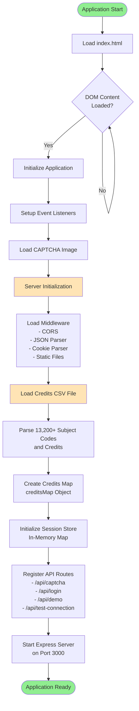
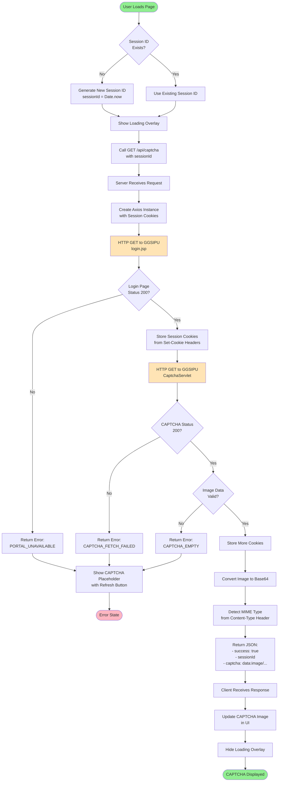
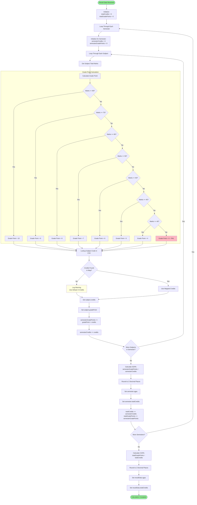
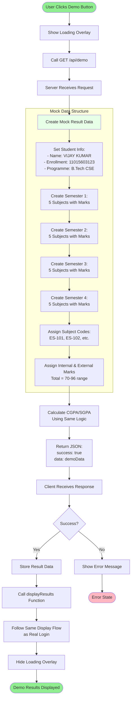
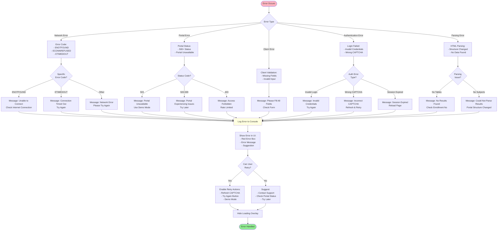
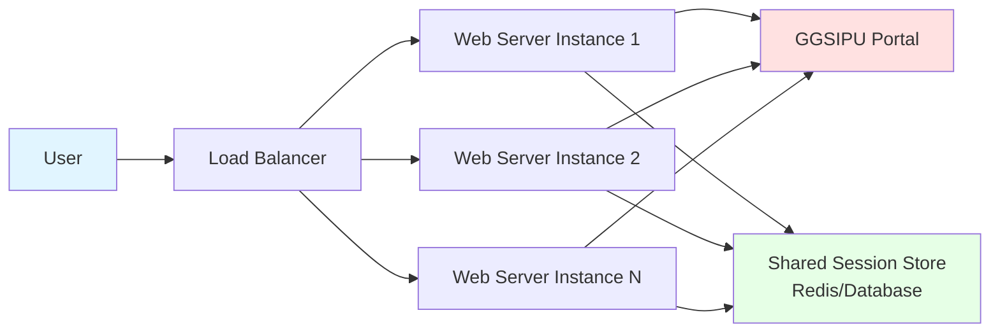

# GGSIPU Result Viewer - System Architecture Flowchart

This document provides a comprehensive reverse-engineered flowchart of the GGSIPU Result Viewer application, documenting its architecture, workflows, and data flows.

## Table of Contents
1. [Overall System Architecture](#overall-system-architecture)
2. [Application Initialization Flow](#application-initialization-flow)
3. [CAPTCHA Fetching Workflow](#captcha-fetching-workflow)
4. [Login and Authentication Flow](#login-and-authentication-flow)
5. [Result Fetching and Parsing Flow](#result-fetching-and-parsing-flow)
6. [CGPA/SGPA Calculation Logic](#cgpasgpa-calculation-logic)
7. [Data Visualization Flow](#data-visualization-flow)
8. [Demo Mode Flow](#demo-mode-flow)
9. [Error Handling Flow](#error-handling-flow)

---

## Overall System Architecture

```mermaid
graph TB
    subgraph "Client Side - Frontend"
        A[User Browser] --> B[index.html]
        B --> C[app.js - JavaScript Logic]
        B --> D[style.css - Styling]
        C --> E[Chart.js Library]
    end
    
    subgraph "Server Side - Backend"
        F[Express Server - server.js]
        F --> G[API Endpoints]
        F --> H[Session Management]
        F --> I[Credits Database CSV]
        G --> J[/api/captcha]
        G --> K[/api/login]
        G --> L[/api/demo]
        G --> M[/api/test-connection]
    end
    
    subgraph "External System"
        N[GGSIPU Portal<br/>examweb.ggsipu.ac.in]
        N --> O[Login Page]
        N --> P[CAPTCHA Servlet]
        N --> Q[Authentication System]
        N --> R[Result Pages]
    end
    
    C -->|API Requests| F
    F -->|HTTP Requests| N
    H -->|Maintains Sessions| N
    I -->|Load Credits| F
    
    style A fill:#e1f5ff
    style F fill:#fff4e1
    style N fill:#ffe1e1
```

---

## Application Initialization Flow



---

## CAPTCHA Fetching Workflow



---

## Login and Authentication Flow

```mermaid
flowchart TD
    Start([User Submits Form]) --> ValidateInput{All Fields<br/>Filled?}
    ValidateInput -->|No| ShowError1[Show Error:<br/>Fill All Fields]
    ValidateInput -->|Yes| ShowLoading[Show Loading Overlay]
    
    ShowLoading --> PrepareData[Prepare Login Data:<br/>- enrollmentNo<br/>- password<br/>- captcha<br/>- sessionId]
    
    PrepareData --> CallAPI[POST /api/login]
    CallAPI --> ServerReceive[Server Receives Request]
    
    ServerReceive --> ValidateServer{Required Fields<br/>Present?}
    ValidateServer -->|No| Error400[Return 400:<br/>Missing Required Fields]
    
    ValidateServer -->|Yes| GetAxios[Get Axios Instance<br/>with Session Cookies]
    GetAxios --> PrepareForm[Prepare Form Data<br/>Multiple Field Name Variants:<br/>- enrollmentNo/enrolmentNo<br/>- captcha/captchaText]
    
    PrepareForm --> PostLogin[HTTP POST to GGSIPU<br/>studentlogin.do]
    PostLogin --> StoreC1[Store Response Cookies]
    StoreC1 --> CheckResponse{Response Contains<br/>Invalid/Incorrect/Wrong?}
    
    CheckResponse -->|Yes| ReturnFail[Return JSON:<br/>success: false<br/>Invalid Credentials]
    CheckResponse -->|No| TryResults[Try Multiple Result URLs:<br/>- view-result.do<br/>- viewResult.do<br/>- result.do<br/>- viewstudentresult.do]
    
    TryResults --> LoopURLs[Loop Through URLs]
    LoopURLs --> FetchResult[HTTP GET Result URL]
    FetchResult --> StoreC2[Store Cookies]
    StoreC2 --> CheckResult{Status 200 &<br/>Contains table?}
    
    CheckResult -->|No| NextURL{More URLs<br/>to Try?}
    NextURL -->|Yes| LoopURLs
    NextURL -->|No| ReturnNoResult[Return Error:<br/>Could Not Fetch Results]
    
    CheckResult -->|Yes| ParseHTML[Parse Result HTML<br/>with Cheerio]
    ParseHTML --> CalcGrades[Calculate CGPA/SGPA]
    CalcGrades --> ReturnSuccess[Return JSON:<br/>success: true<br/>data: resultData]
    
    ReturnSuccess --> ClientReceive[Client Receives Response]
    ClientReceive --> CheckSuccess{Login<br/>Successful?}
    
    CheckSuccess -->|No| ShowError2[Show Error Message<br/>Refresh CAPTCHA]
    CheckSuccess -->|Yes| StoreResult[Store Result Data<br/>in resultData Variable]
    StoreResult --> DisplayResults[Call displayResults]
    DisplayResults --> HideLogin[Hide Login Section]
    HideLogin --> ShowResults[Show Results Section]
    ShowResults --> PopulateInfo[Populate Student Info]
    PopulateInfo --> UpdateCGPA[Update CGPA Display]
    UpdateCGPA --> DrawCharts[Draw Charts]
    DrawCharts --> ShowSemesters[Show Semester Tables]
    ShowSemesters --> ScrollTop[Scroll to Top]
    ScrollTop --> HideLoading[Hide Loading Overlay]
    HideLoading --> End([Results Displayed])
    
    ShowError1 --> ErrorEnd([Error State])
    ShowError2 --> ErrorEnd
    ReturnFail --> ErrorEnd
    ReturnNoResult --> ErrorEnd
    Error400 --> ErrorEnd
    
    style Start fill:#90EE90
    style End fill:#90EE90
    style ErrorEnd fill:#FFB6C1
    style PostLogin fill:#FFE4B5
    style FetchResult fill:#FFE4B5
```



---

## Result Fetching and Parsing Flow

```mermaid
flowchart TD
    Start([HTML Data Received]) --> LoadCheerio[Load HTML with Cheerio]
    LoadCheerio --> InitResult[Initialize Result Object:<br/>- studentName<br/>- enrollmentNo<br/>- programme<br/>- semesters array]
    
    InitResult --> ExtractInfo[Extract Student Information]
    
    subgraph "Student Info Extraction"
        ExtractInfo --> ScanCells[Scan All td, th, span, div]
        ScanCells --> FindName{Text Matches<br/>'Student Name'?}
        FindName -->|Yes| GetName[Get Next Cell Value<br/>as Student Name]
        FindName -->|No| FindEnroll{Text Matches<br/>'Enrollment No'?}
        FindEnroll -->|Yes| GetEnroll[Get Next Cell Value<br/>as Enrollment No]
        FindEnroll -->|No| FindProg{Text Matches<br/>'Programme'?}
        FindProg -->|Yes| GetProg[Get Next Cell Value<br/>as Programme]
        FindProg -->|No| Continue[Continue Scanning]
    end
    
    Continue --> ParseTables[Find All table Elements]
    ParseTables --> InitSem[Initialize Semester Counter = 1]
    
    InitSem --> LoopTables[Loop Through Each Table]
    LoopTables --> InitSubjects[Initialize Empty Subjects Array]
    InitSubjects --> FindHeaders[Scan First Row for Headers]
    
    subgraph "Identify Columns"
        FindHeaders --> CheckCode{Header Contains<br/>'code' or 'sub no'?}
        CheckCode -->|Yes| SaveCodeCol[Save Code Column Index]
        CheckCode -->|No| CheckName{Header Contains<br/>'subject name'?}
        CheckName -->|Yes| SaveNameCol[Save Name Column Index]
        CheckName -->|No| CheckInt{Header Contains<br/>'internal' or 'mid'?}
        CheckInt -->|Yes| SaveIntCol[Save Internal Column Index]
        CheckInt -->|No| CheckExt{Header Contains<br/>'external' or 'end'?}
        CheckExt -->|Yes| SaveExtCol[Save External Column Index]
        CheckExt -->|No| CheckTotal{Header Contains<br/>'total' or 'grand'?}
        CheckTotal -->|Yes| SaveTotalCol[Save Total Column Index]
        CheckTotal -->|No| NextHeader[Next Header]
    end
    
    NextHeader --> ParseRows[Parse Data Rows]
    ParseRows --> LoopRows[Loop Through Rows]
    LoopRows --> GetCells[Get All Cells in Row]
    
    GetCells --> ExtractValues[Extract Values:<br/>- Subject Code<br/>- Subject Name<br/>- Internal Marks<br/>- External Marks<br/>- Total Marks]
    
    ExtractValues --> ValidateCode{Subject Code<br/>Matches Pattern?}
    ValidateCode -->|No| SkipRow[Skip Row]
    ValidateCode -->|Yes| ValidateTotal{Total > 0?}
    ValidateTotal -->|No| CalcTotal[Calculate Total =<br/>Internal + External]
    ValidateTotal -->|Yes| AddSubject[Add Subject to Array]
    CalcTotal --> AddSubject
    
    AddSubject --> MoreRows{More Rows<br/>in Table?}
    MoreRows -->|Yes| LoopRows
    MoreRows -->|No| CheckSubjects{Found Any<br/>Subjects?}
    
    CheckSubjects -->|Yes| CreateSemester[Create Semester Object:<br/>- semester: number<br/>- subjects: array]
    CheckSubjects -->|No| SkipTable[Skip This Table]
    
    CreateSemester --> AddSemester[Add to Semesters Array]
    AddSemester --> IncrementSem[Increment Semester Counter]
    IncrementSem --> MoreTables{More Tables?}
    
    SkipRow --> MoreRows
    SkipTable --> MoreTables
    
    MoreTables -->|Yes| LoopTables
    MoreTables -->|No| ReturnResult[Return Parsed Result Object]
    ReturnResult --> End([Parsing Complete])
    
    style Start fill:#90EE90
    style End fill:#90EE90
    style LoadCheerio fill:#FFE4B5
```



---

## CGPA/SGPA Calculation Logic



---

## Data Visualization Flow

```mermaid
flowchart TD
    Start([Display Results Called]) --> ShowResults[Show Results Section]
    ShowResults --> PopulateInfo[Populate Student Information:<br/>- Name<br/>- Enrollment No<br/>- Programme]
    
    PopulateInfo --> DisplayCGPA[Display CGPA Value]
    DisplayCGPA --> CalcPercentage[Calculate CGPA Percentage<br/>= cgpa / 10 × 100]
    CalcPercentage --> UpdateBar[Update CGPA Progress Bar Width]
    UpdateBar --> ShowCredits[Display Total Credits]
    
    ShowCredits --> CreateSGPAChart[Create SGPA Bar Chart]
    
    subgraph "SGPA Chart Creation"
        CreateSGPAChart --> GetCtx1[Get Canvas Context<br/>sgpaChart]
        GetCtx1 --> PrepareLabels[Prepare Labels:<br/>Sem 1, Sem 2, ...]
        PrepareLabels --> PrepareData1[Prepare Data:<br/>SGPA Values Array]
        PrepareData1 --> DestroyOld1{Existing Chart?}
        DestroyOld1 -->|Yes| Destroy1[Destroy Old Chart]
        DestroyOld1 -->|No| CreateNew1[Create New Chart.js Instance]
        Destroy1 --> CreateNew1
        CreateNew1 --> ConfigBar[Configure Bar Chart:<br/>- Type: bar<br/>- Color: Blue Gradient<br/>- Y-axis: 0-10<br/>- Border Radius: 8px]
    end
    
    ConfigBar --> CreateSubjectChart[Create Subject Performance Chart]
    
    subgraph "Subject Chart Creation"
        CreateSubjectChart --> GetCtx2[Get Canvas Context<br/>subjectChart]
        GetCtx2 --> CollectSubjects[Collect All Subjects<br/>from All Semesters]
        CollectSubjects --> LimitSubjects[Limit to First 10 Subjects<br/>for Better Visualization]
        LimitSubjects --> PrepareLabels2[Prepare Labels:<br/>Subject Codes]
        PrepareLabels2 --> PrepareData2[Prepare Data:<br/>Grade Points Array]
        PrepareData2 --> DestroyOld2{Existing Chart?}
        DestroyOld2 -->|Yes| Destroy2[Destroy Old Chart]
        DestroyOld2 -->|No| CreateNew2[Create New Chart.js Instance]
        Destroy2 --> CreateNew2
        CreateNew2 --> ConfigLine[Configure Line Chart:<br/>- Type: line<br/>- Color: Purple Gradient<br/>- Tension: 0.4<br/>- Fill: true<br/>- Y-axis: 0-10]
    end
    
    ConfigLine --> CreateTables[Create Semester Tables]
    
    subgraph "Table Creation"
        CreateTables --> ClearContainer[Clear semesterResults Container]
        ClearContainer --> LoopSemesters[Loop Through Each Semester]
        LoopSemesters --> CreateCard[Create Semester Card]
        CreateCard --> AddHeader[Add Semester Header:<br/>- Semester Number<br/>- SGPA Badge]
        AddHeader --> CreateTable[Create HTML Table]
        CreateTable --> AddTableHeader[Add Table Headers:<br/>- Subject Code<br/>- Subject Name<br/>- Internal<br/>- External<br/>- Total<br/>- Credits<br/>- Grade Point]
        AddTableHeader --> LoopSubjects[Loop Through Subjects]
        LoopSubjects --> CreateRow[Create Table Row]
        CreateRow --> AddCells[Add Cells with Data]
        AddCells --> StyleGrade[Apply Grade Color:<br/>- O: Green<br/>- A: Light Green<br/>- B: Yellow<br/>- C: Orange<br/>- D: Red<br/>- F: Gray]
        StyleGrade --> MoreSubjects{More Subjects?}
        MoreSubjects -->|Yes| LoopSubjects
        MoreSubjects -->|No| AppendTable[Append Table to Card]
        AppendTable --> AppendCard[Append Card to Container]
        AppendCard --> MoreSemesters{More Semesters?}
        MoreSemesters -->|Yes| LoopSemesters
    end
    
    MoreSemesters -->|No| ScrollTop[Scroll Page to Top<br/>Smooth Scroll]
    ScrollTop --> End([Visualization Complete])
    
    style Start fill:#90EE90
    style End fill:#90EE90
    style CreateNew1 fill:#E6F3FF
    style CreateNew2 fill:#E6F3FF
```



---

## Demo Mode Flow



---

## Error Handling Flow



---

## Technology Stack

### Frontend
- **HTML5**: Structure and layout
- **CSS3**: Styling with gradients, animations, responsive design
- **JavaScript (ES6+)**: Client-side logic, event handling, API calls
- **Chart.js 4.4.0**: Data visualization (bar charts, line charts)

### Backend
- **Node.js**: JavaScript runtime
- **Express.js 4.18.2**: Web framework
- **Axios 1.6.2**: HTTP client for GGSIPU portal requests
- **Cheerio 1.1.2**: Server-side HTML parsing (jQuery-like syntax)
- **Cookie-Parser 1.4.6**: Parse and manage session cookies
- **CORS 2.8.5**: Enable cross-origin requests

### Data
- **CSV File**: 13,200+ subject codes mapped to credits
- **In-Memory Map**: Session storage (sessions Map object)

### External Integration
- **GGSIPU Portal**: examweb.ggsipu.ac.in
  - Login page: `/web/login.jsp`
  - CAPTCHA: `/web/CaptchaServlet`
  - Authentication: `/web/studentlogin.do`
  - Results: Multiple possible URLs

---

## Data Flow Summary

### Request Flow
```
User Browser → Frontend (app.js) → Express Server (server.js) → GGSIPU Portal
```

### Response Flow
```
GGSIPU Portal → Express Server → Parse with Cheerio → Calculate Grades → Frontend → Chart.js → Display
```

### Session Management
```
Client Session ID ↔ Server Session Store ↔ GGSIPU Portal Cookies
```

---

## Key Features Documented

1. **Real-time CAPTCHA**: Fetches actual CAPTCHA from GGSIPU portal
2. **Session Persistence**: Maintains cookies across requests
3. **Intelligent Parsing**: Handles various HTML table structures
4. **Credit Mapping**: Maps 13,200+ subjects to official credits
5. **Auto Calculation**: Computes SGPA and CGPA automatically
6. **Responsive Visualizations**: Interactive charts with Chart.js
7. **Error Recovery**: Comprehensive error handling with retry mechanisms
8. **Demo Mode**: Test interface without portal access
9. **Multiple URL Attempts**: Tries various result page URLs
10. **Fallback Credits**: Uses default 3 credits when code not found

---

## Security Considerations

1. **HTTPS Agent**: Configurable SSL certificate validation
2. **No Credential Storage**: Credentials not stored on server
3. **Session Isolation**: Each user gets unique session
4. **Cookie Management**: Proper cookie handling and isolation
5. **Input Validation**: Both client and server-side validation
6. **Error Sanitization**: No sensitive data in error messages
7. **CORS Protection**: Configured cross-origin policies
8. **Timeout Handling**: 30-second request timeout

---

## Deployment Architecture



**Note**: Current implementation uses in-memory sessions. For production with multiple instances, implement Redis or database-backed session storage.

---

## Future Enhancements Identified

1. **Persistent Sessions**: Redis or database-backed storage
2. **Caching**: Cache subject credits in memory/Redis
3. **Rate Limiting**: Implement request rate limiting
4. **PDF Export**: Generate PDF reports of results
5. **Comparison**: Compare performance across semesters
6. **Predictions**: Predict future CGPA based on trends
7. **Mobile App**: Native mobile application
8. **Notifications**: Email/SMS notifications for new results
9. **Analytics**: Track usage patterns and errors
10. **Multi-University**: Support other university portals

---

*This flowchart documentation was reverse-engineered from the GGSIPU Result Viewer codebase to provide comprehensive understanding of the system architecture and workflows.*
